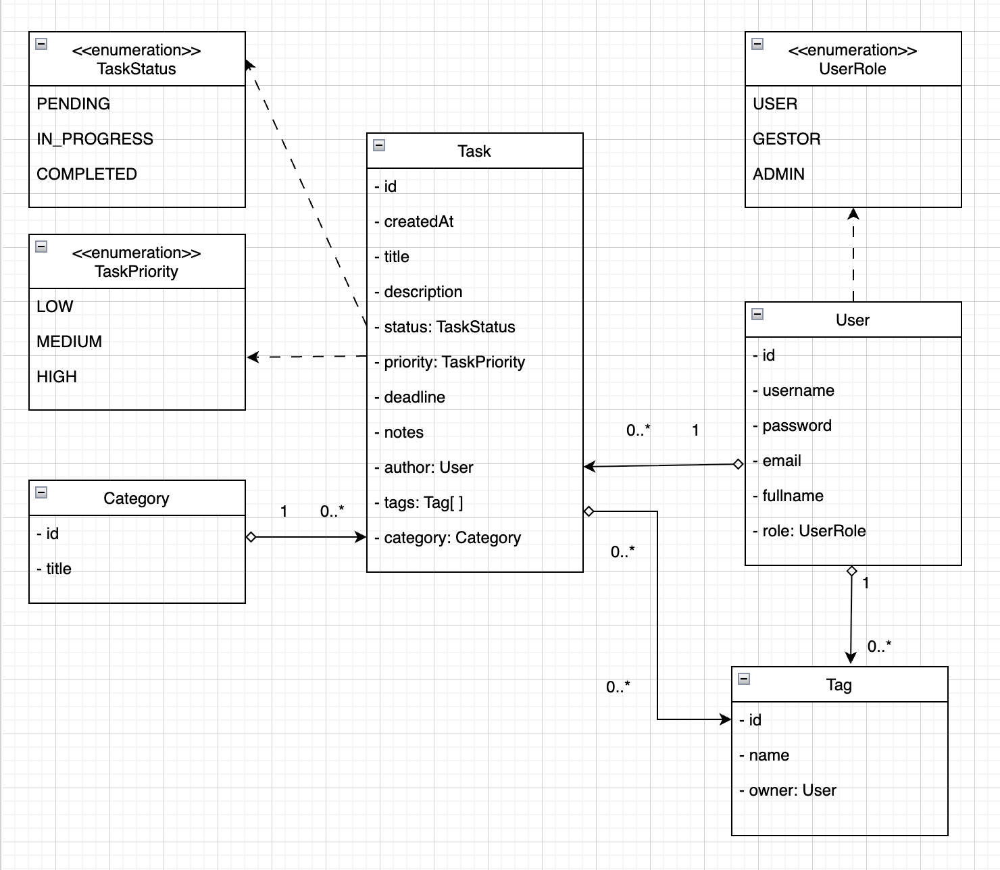
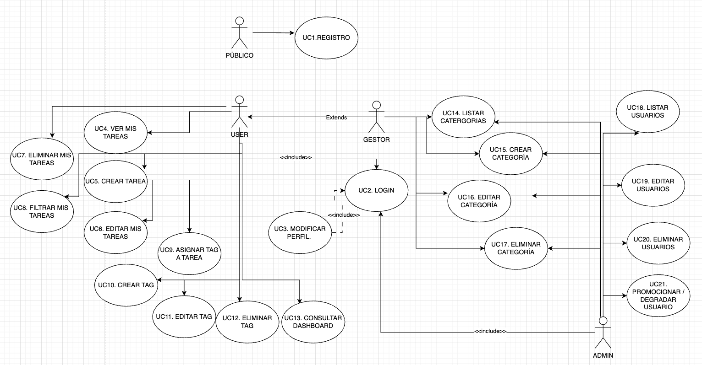
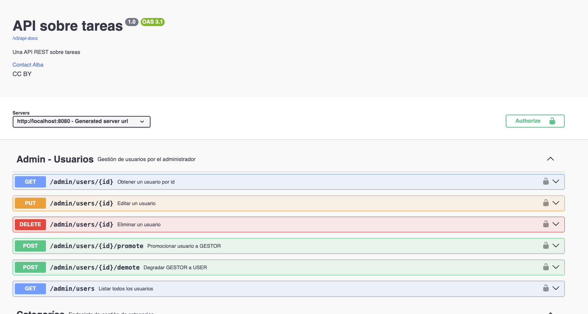

# Todo REST — API REST con Spring Boot

API REST para la gestión de tareas (To-Do List) desarrollada con **Spring Boot 4** y **Java 17**, con autenticación, control de acceso por roles y documentación Swagger. Forma parte de un proyecto Full Stack junto con el frontend en React ([taskrest-front](https://github.com)).

---

## Tecnologías

| Tecnología | Versión | Uso |
|---|---|---|
| Java | 17 | Lenguaje de programación |
| Spring Boot | 4.0.2 | Framework principal |
| Spring Security | — | Autenticación y autorización (Basic Auth) |
| Spring Data JPA | — | Acceso y persistencia de datos |
| MySQL | — | Base de datos relacional |
| Lombok | — | Reducción de código boilerplate |
| Springdoc OpenAPI | 3.0.1 | Documentación Swagger UI |

---

## Requisitos

- Java 17+
- Maven
- MySQL en ejecución

---

## Configuración

Crea la base de datos en MySQL:

```sql
CREATE DATABASE todo_db;
```

Configura las credenciales en `src/main/resources/application.properties`:

```properties
spring.datasource.url=jdbc:mysql://localhost:3306/todo_db
spring.datasource.username=tu_usuario
spring.datasource.password=tu_contraseña
```

---

## Ejecutar el proyecto

```bash
./mvnw spring-boot:run
```

La aplicación se levanta en `http://localhost:8080`.

Al arrancar, se crean automáticamente tres usuarios de ejemplo:

| Usuario | Contraseña | Rol |
|---|---|---|
| admin | admin | ADMIN |
| user1 | 12345 | USER |
| user2 | 12345 | USER |

---

## Modelado de datos



---

## Casos de uso



---

## Endpoints

### Autenticación

| Método | Ruta | Acceso | Descripción |
|---|---|---|---|
| POST | `/auth/register` | Público | Registrar nuevo usuario |
| GET | `/auth/me` | Autenticado | Obtener usuario autenticado |
| PUT | `/user/profile` | Autenticado | Modificar perfil propio |

### Tareas

| Método | Ruta | Acceso | Descripción |
|---|---|---|---|
| GET | `/task/` | USER/GESTOR | Listar tareas propias |
| GET | `/task/{id}` | USER/GESTOR | Obtener tarea por ID |
| POST | `/task/` | USER/GESTOR | Crear tarea |
| PUT | `/task/{id}` | USER/GESTOR | Editar tarea |
| DELETE | `/task/{id}` | USER/GESTOR | Eliminar tarea |
| GET | `/task/search?title=` | USER/GESTOR | Buscar por título |
| GET | `/task/search?status=` | USER/GESTOR | Buscar por estado |
| GET | `/task/search?priority=` | USER/GESTOR | Buscar por prioridad |
| GET | `/task/by-tag?tag=` | USER/GESTOR | Buscar por etiqueta |
| POST | `/task/{id}/tags` | USER/GESTOR | Asignar etiquetas a una tarea |
| DELETE | `/task/{id}/tags/{tagId}` | USER/GESTOR | Desasociar etiqueta de una tarea |

### Etiquetas

| Método | Ruta | Acceso | Descripción |
|---|---|---|---|
| GET | `/tag/` | USER/GESTOR | Listar etiquetas propias |
| GET | `/tag/{id}` | USER/GESTOR | Obtener etiqueta por ID |
| POST | `/tag/` | USER/GESTOR | Crear etiqueta |
| PUT | `/tag/{id}` | USER/GESTOR | Editar etiqueta |
| DELETE | `/tag/{id}` | USER/GESTOR | Eliminar etiqueta |

### Categorías

| Método | Ruta | Acceso | Descripción |
|---|---|---|---|
| GET | `/categories` | Autenticado | Listar categorías |
| GET | `/manager/categories` | GESTOR/ADMIN | Listar categorías |
| POST | `/manager/categories` | GESTOR/ADMIN | Crear categoría |
| PUT | `/manager/categories/{id}` | GESTOR/ADMIN | Editar categoría |
| DELETE | `/manager/categories/{id}` | GESTOR/ADMIN | Eliminar categoría |
| GET | `/admin/categories` | ADMIN | Listar categorías |
| POST | `/admin/categories` | ADMIN | Crear categoría |
| PUT | `/admin/categories/{id}` | ADMIN | Editar categoría |
| DELETE | `/admin/categories/{id}` | ADMIN | Eliminar categoría |

### Usuarios (Admin)

| Método | Ruta | Acceso | Descripción |
|---|---|---|---|
| GET | `/admin/users` | ADMIN | Listar todos los usuarios |
| GET | `/admin/users/{id}` | ADMIN | Obtener usuario por ID |
| PUT | `/admin/users/{id}` | ADMIN | Editar usuario |
| DELETE | `/admin/users/{id}` | ADMIN | Eliminar usuario |
| POST | `/admin/users/{id}/promote` | ADMIN | Promocionar USER a GESTOR |
| POST | `/admin/users/{id}/demote` | ADMIN | Degradar GESTOR a USER |

### Dashboard

| Método | Ruta | Acceso | Descripción |
|---|---|---|---|
| GET | `/dashboard` | USER/GESTOR | Estadísticas de tareas propias |

---

## Ejemplos de uso

### Registro de usuario

```bash
curl -X POST http://localhost:8080/auth/register \
  -H "Content-Type: application/json" \
  -d '{
    "username": "pepe",
    "email": "pepe@example.com",
    "fullname": "Pepe García",
    "password": "1234"
  }'
```

### Crear tarea

```bash
curl -X POST http://localhost:8080/task/ \
  -u user1:12345 \
  -H "Content-Type: application/json" \
  -d '{
    "title": "Aprender Spring Boot",
    "description": "Hacer todos los cursos de Spring Boot en Openwebinars.net",
    "deadline": "2026-12-31T23:59:59",
    "priority": "HIGH",
    "categoryId": 1,
    "tagIds": [1]
  }'
```

---

## Seguridad

- Todos los endpoints están protegidos con **HTTP Basic Auth** salvo `/auth/register`.
- El acceso se controla por roles: `USER`, `GESTOR` y `ADMIN`.
- Cada usuario solo puede ver y gestionar sus propios recursos.
- Las contraseñas se almacenan cifradas con **BCrypt**.

---

## Documentación API (Swagger)

Con la aplicación en ejecución, accede a:

- **Swagger UI:** `http://localhost:8080/swagger-ui/index.html`
- **OpenAPI JSON:** `http://localhost:8080/v3/api-docs`



---

## Despliegue con Docker

El proyecto está preparado para desplegarse con Docker Compose junto al frontend y la base de datos en un servidor VPS de **IONOS**.

```bash
docker-compose up -d
```
